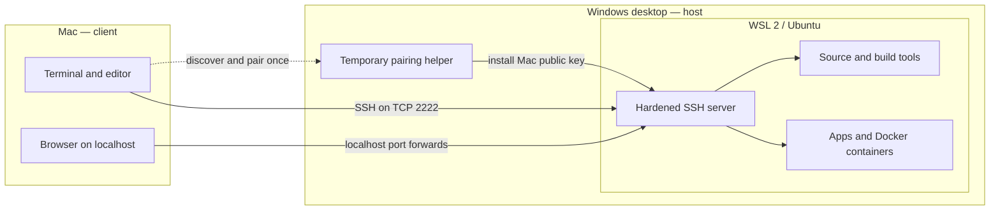

<p align="center">
  
</p>

<h1 align="center">otherhost</h1>

<p align="center"><strong>Make the other host feel local.</strong></p>
<p align="center"><code>localhost → otherhost</code></p>

[](https://github.com/M3ndes/otherhost/actions/workflows/ci.yml)
[](LICENSE)

Use a Windows desktop as a private WSL 2 and Docker development machine from
your Mac. Pair the two computers with a Bluetooth-style six-digit check, then
connect over SSH with one command.

```text
Windows:  .\setup.cmd -Pair       Mac:  otherhost pair
          Code 482 731                  Code 482 731
                         confirm both

Mac:      otherhost connect
```

Otherhost is open source, CLI-first, and intentionally inspectable. There
is no cloud relay or project account. Your source, builds, and containers stay
on the Windows computer; the Mac is the keyboard, editor, and browser.

> **Project status:** early stage. CI covers the portable scripts and pairing
> protocol; full Windows + WSL + macOS behavior still requires real-machine
> testing. Command details may evolve before a stable `1.0` release. Bug reports
> and focused pull requests are welcome.

## Why use it?

A powerful desktop is often a better place to compile code, run containers, or
host large development databases. A Mac laptop is often a better place to work
interactively. otherhost joins them without copying a private SSH key,
opening a public service, or requiring users to understand every networking
detail first.

- **Fast local pairing:** discover the Windows host and compare one six-digit
  code on both screens.
- **Secure by default:** public-key-only SSH, pinned host identity, encrypted
  pairing, and localhost-only service tunnels.
- **One Windows setup command:** checks the machine, asks once, elevates through
  UAC, and configures Windows and WSL.
- **Useful diagnostics:** each layer reports what it checked and where a failure
  occurred.
- **Project-first dashboard:** browse remote repositories and host capacity from
  an English, localhost-only interface backed by the same pinned SSH connection.
- **Automation-friendly:** Bash, PowerShell, and a small dependency-free Go
  pairing helper; no required GUI or hosted control plane.

## The simple mental model

The Windows computer is the **host**. It owns WSL, the source files, build tools,
and Docker containers. The Mac is the **client**. It reaches WSL through
OpenSSH and exposes local browser URLs for services running there.



Pairing and daily use are separate:

1. **Pairing** is a temporary, two-minute local-network exchange. It installs
   the Mac's public key and teaches the Mac which SSH host identity to trust.
2. **Daily connection** uses normal OpenSSH. `otherhost connect` keeps configured
   port forwards open until you press `Ctrl-C`.

New to SSH, ports, WSL, or tunneling? Read [How it works](docs/how-it-works.md)
for a plain-language walkthrough.

## Upgrading from devbox-bridge

The project and repository are now named **Otherhost**. Existing installations
remain connected during the transition:

- `devbox` remains a deprecated command alias for `otherhost`;
- `devbox.local.conf` is read as a fallback and `bootstrap-mac.sh --apply`
  migrates it to `otherhost.local.conf` without evaluating its contents;
- existing SSH identity and pinned `known_hosts` paths are reused;
- already-installed v0.1.1 pairing helpers remain wire-compatible;
- the former GitHub URL redirects, but existing clones should update their
  remote with `git remote set-url origin https://github.com/M3ndes/otherhost.git`.

No re-pair is required solely because of the rename. Rerun the platform
bootstrap on each machine to install the new command and paths.

## Requirements

### Windows host

- Windows 11 22H2 (build 22621) or newer;
- current WSL 2 with an Ubuntu distribution;
- Git in the Windows environment used to clone this repository;
- Docker Desktop with its WSL 2 backend when you need containers.

### Mac client

- macOS with Git and OpenSSH;
- a shell supported by the system-provided Bash and standard macOS tools.

### Network

Both computers should be on the same trusted home or office network for initial
pairing. They do not need to use the same kind of connection: Windows may use
Ethernet while the Mac uses Wi-Fi, provided the router allows the two devices to
communicate. Guest Wi-Fi and client-isolation features commonly block this.

For access away from that network, add a private overlay network such as
Tailscale after local setup works. Never forward the SSH or pairing ports from a
public router directly to the host.

## Quick start

### 1. Prepare Windows

Clone this repository on Windows. Open PowerShell in the checkout and run:

```powershell
.\setup.cmd
```

The command performs a read-only preflight, shows the planned changes, asks for
one confirmation, and requests Administrator permission through UAC. It then
prepares WSL resources, mirrored networking, firewall policy, and a hardened
SSH server. Normal setup does not require a GitHub account or a Mac SSH key.

For a read-only check without applying changes:

```powershell
.\setup.cmd -Check
```

### 2. Install the Mac client

```bash
git clone https://github.com/M3ndes/otherhost.git
cd otherhost
./scripts/bootstrap-mac.sh --apply
```

The installer adds `otherhost` under `~/.local/bin` and installs a
checksum-verified pairing helper for the Mac architecture. Existing
configuration and keys are preserved. The dedicated SSH private key is created
on first pairing and never leaves the Mac.

### 3. Pair the computers

On Windows, start a two-minute discovery window and leave it open:

```powershell
.\setup.cmd -Pair
```

On the Mac, run:

```bash
otherhost pair
```

The Mac tries multicast discovery first and then scans only its local IPv4
subnet on the fixed pairing port. Both screens display a code:

```text
Windows                                  Mac
MacBook-Pro wants to connect.            Found DESKTOP-HOME
Pairing code: 482 731                    Pairing code: 482 731
Does the Mac show the same code?         Does Windows show the same code?
```

Confirm **only** when the device name and code match. The code is compared, not
typed or sent as a password. After confirmation, pairing installs the Mac
public key, pins the WSL SSH host key, saves the connection details, and runs a
health check.

If discovery does not work, keep both commands open and follow the
[pairing decision guide](docs/troubleshooting.md#otherhost-pair-finds-no-windows-otherhost).
The `[diag]` output identifies whether multicast, direct discovery, the listener,
or SSH failed.

### 4. Connect from the Mac

```bash
otherhost connect
```

Keep that terminal open. Configured services are now available through Mac
localhost URLs. In another terminal:

```bash
otherhost urls
otherhost status
```

For an editor with Remote SSH support, review the generated host block before
adding it to `~/.ssh/config`:

```bash
otherhost ssh-config
```

### Browse remote projects

The optional project dashboard remains backed by the CLI and opens only on the
Mac loopback interface:

```bash
otherhost ui
```

It discovers Git repositories directly below `projects_root` (by default
`~/src` inside WSL), shows the Windows hardware inventory and WSL allocation,
and opens a selected folder through VS Code Remote SSH. Add the reviewed output
from `otherhost ssh-config` to `~/.ssh/config` before using **Open project**.

The UI is entirely in English, loads no remote assets, sends no telemetry, and
does not expose its local HTTP server to the LAN. Docker remains available in
CLI diagnostics but is not treated as a primary machine-health signal in the
project dashboard.

## Commands

| Command | Where | Purpose |
| --- | --- | --- |
| `.\setup.cmd` | Windows | Check and configure the Windows + WSL host |
| `.\setup.cmd -Check` | Windows | Run the host preflight without changing anything |
| `.\setup.cmd -Pair` | Windows | Make the host discoverable for two minutes |
| `otherhost pair` | Mac | Discover, verify, and save a host |
| `otherhost doctor` | Mac | Validate configuration, keys, dependencies, and SSH |
| `otherhost connect` | Mac | Keep all configured SSH port forwards open |
| `otherhost status` | Mac | Show remote uptime, memory, disk, and Docker usage |
| `otherhost urls` | Mac | Print forwarded localhost URLs |
| `otherhost ssh-config` | Mac | Generate an OpenSSH host block |
| `otherhost ui` | Mac | Open the local project and machine dashboard |

## Alternative host mode

If Ubuntu, systemd, and WSL mirrored networking already work, an experienced
user can install a user-scoped host without PowerShell, Administrator access, or
`sudo`:

```bash
cd ~/src/otherhost
./scripts/bootstrap-wsl-user.sh --apply
./scripts/pair-wsl.sh
```

This mode extracts OpenSSH from Ubuntu's signed packages into `~/.local` and
runs it as a systemd user service. It does not install WSL or change Windows
firewall policy. See [Windows and WSL host](docs/windows-wsl.md) before choosing
this route.

## Security at a glance

- Pairing uses fresh X25519 keys, HKDF-SHA-256, and authenticated AES-256-GCM
  messages.
- The six-digit comparison binds the complete session and is never transmitted.
- Only the Mac's **public** SSH key crosses the network; its private key remains
  on the Mac.
- The Mac pins the authenticated WSL Ed25519 host key and fails closed if it
  later changes.
- SSH password login and root login are disabled.
- Pairing listeners and Windows firewall exceptions are temporary and restricted
  to the active local subnet.
- Forwarded applications bind to Mac `127.0.0.1`, not its LAN interfaces.
- Configuration files are parsed as data and are never executed as shell or
  PowerShell code.

The six-digit code protects against an active device impersonating either side
only when the user actually compares it. It does not make an untrusted network
safe for unrelated traffic or secure an already-compromised computer. Read the
full [security policy and trust model](SECURITY.md).

## Documentation

| Guide | Start here when... |
| --- | --- |
| [How it works](docs/how-it-works.md) | You want the network and security model in plain language |
| [Windows and WSL host](docs/windows-wsl.md) | You are setting up or operating the Windows computer |
| [macOS client](docs/macos.md) | You are installing, pairing, or using the Mac command |
| [Troubleshooting](docs/troubleshooting.md) | A setup, discovery, SSH, or Docker step failed |
| [Architecture and decisions](docs/architecture.md) | You want protocol details or plan a code change |
| [Brand and visual identity](docs/brand.md) | You need the name, voice, logo, or visual tokens |
| [Contributing](CONTRIBUTING.md) | You want to report, test, document, or implement a change |
| [Security policy](SECURITY.md) | You need deployment boundaries or private reporting instructions |

## Scope and non-goals

otherhost configures a trusted remote-development path. It does **not**:

- install Docker Desktop itself;
- change router settings or expose the host to the public internet;
- synchronize source code or private keys between devices;
- provide a cloud relay, account system, or remote wake service;
- keep Windows awake or manage OS updates and backups;
- replace a VPN when the computers are on different networks.

## Contributing

Issues and pull requests are welcome. Please search existing issues, describe the
Windows/WSL/macOS versions involved, and redact private keys, tokens, usernames,
hostnames, and LAN addresses from logs. Run `make test` before submitting code.
See [CONTRIBUTING.md](CONTRIBUTING.md) for the development workflow and review
checklist.

Licensed under the [MIT License](LICENSE).
