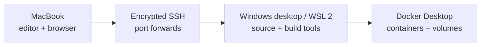

# devbox-bridge

Turn a Windows desktop with WSL 2 and Docker Desktop into a private development
machine that a Mac can use over SSH.

The project is CLI-first: setup stays inspectable, automation works in terminals
and CI, and every machine keeps its own untracked configuration. A graphical UI
may come later, after the setup workflow is stable; it is not required to get a
useful remote devbox.

## What it provides

- a macOS command for health checks, SSH tunnels, URLs, and remote status;
- a PowerShell bootstrap for WSL resources, mirrored networking, and firewall;
- a WSL bootstrap for systemd, hardened SSH, Docker checks, and optional cloning;
- configuration parsed as data, never executed as shell or PowerShell code;
- no passwords, tokens, or private keys committed to Git.



## Requirements

- Mac with Git and OpenSSH;
- Windows 11 22H2 or newer for mirrored WSL networking;
- WSL 2 with an Ubuntu distribution;
- Docker Desktop using the WSL 2 backend;
- both machines on the same trusted network for the first setup.

For access away from home, add a private overlay network such as Tailscale later.
Do not expose the SSH port directly on the public internet.

## Start on the Mac

```bash
git clone https://github.com/M3ndes/devbox-bridge.git
cd devbox-bridge
cp config/devbox.example.conf devbox.local.conf
./scripts/bootstrap-mac.sh --apply --generate-key
```

Edit `devbox.local.conf`. At minimum, set `host` and `ssh_user` later. Upload the
generated public key to GitHub so Windows can discover it without moving any
private material:

```bash
gh ssh-key add ~/.ssh/devbox_bridge_ed25519.pub --title "devbox-bridge Mac"
```

If you do not use GitHub CLI, add the `.pub` file in GitHub's **SSH and GPG
keys** settings. Never upload the private key (the file without `.pub`).

Print the dedicated key's fingerprint so you can recognize it during Windows
setup:

```bash
ssh-keygen -lf ~/.ssh/devbox_bridge_ed25519.pub -E sha256
```

Commit and push only the repository files. `devbox.local.conf` remains local on
each machine.

## Continue on Windows

Open PowerShell in a Windows checkout of this repository and run:

```powershell
.\setup.cmd
```

The command performs a read-only preflight, asks for one confirmation, requests
Administrator permission through UAC, and completes the Windows and Ubuntu
setup. It automatically:

- selects a resource policy based on the desktop hardware;
- keeps the operational clone under `~/src/devbox-bridge` inside WSL;
- creates the machine-local configuration and detects the Ubuntu user;
- configures mirrored networking and the Hyper-V firewall;
- installs and hardens OpenSSH, then authorizes exactly one selected Mac key.

The setup asks for the GitHub account, displays the available key fingerprints,
and asks you to select the dedicated Mac key. It never treats the repository
owner as your identity. For a non-interactive run, pass the explicit account and
fingerprint shown on the Mac:

```powershell
.\setup.cmd -GitHubUser YOUR_USER -GitHubKeyFingerprint SHA256:YOUR_FINGERPRINT -Yes
```

The WSL operational clone is pinned to the exact revision of the Windows
checkout. Privileged WSL configuration runs from that same reviewed Windows
checkout instead of executing an unrelated second copy. Setup refuses a dirty
checkout so the executed scripts match the verified Git revision.

To stop after the read-only report:

```powershell
.\setup.cmd -Check
```

Docker is not required for SSH connectivity. For container workloads, enable
**Docker Desktop > Resources > WSL Integration > Ubuntu** after setup.

The SSH bridge is ready when all of these are true:

1. `wsl --list --verbose` shows Ubuntu using WSL 2.
2. `systemctl is-active ssh` prints `active`.
3. `ss -lnt | grep 2222` shows the SSH listener.
4. `devbox doctor` succeeds from the Mac after its `host` value is set.

Container workloads are ready when `docker info` also works inside Ubuntu.

## Connect from the Mac

Use the desktop's Windows LAN address in `host`, then:

```bash
devbox doctor
devbox connect
```

Keep `devbox connect` running. Services on the configured ports are now available
through `localhost` on the Mac. In another terminal:

```bash
devbox urls
devbox status
```

After the one-time setup, the normal daily workflow is just `devbox connect`.

For editors with Remote SSH support, review the generated block before adding it
to `~/.ssh/config`:

```bash
devbox ssh-config
```

## Commands

| Command | Purpose |
| --- | --- |
| `devbox doctor` | Validate config, dependencies, key permissions, and SSH |
| `devbox connect` | Keep all configured SSH port forwards open |
| `devbox status` | Show remote uptime, memory, disk, and Docker usage |
| `devbox urls` | Print forwarded localhost URLs |
| `devbox ssh-config` | Generate an OpenSSH host block |

Run `make test` before contributing. See [Windows and WSL setup](docs/windows-wsl.md),
[troubleshooting](docs/troubleshooting.md), [macOS usage](docs/macos.md), and
[architecture](docs/architecture.md) for details.

## Scope

This project configures a trusted remote development path. It does not install
Docker Desktop, change router settings, synchronize private keys, or keep a
Windows machine awake. Those remain explicit host-owner decisions.

Licensed under the [MIT License](LICENSE).
