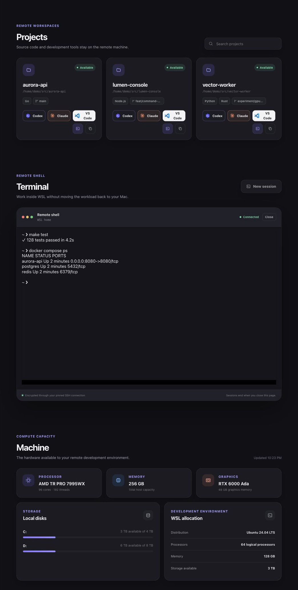
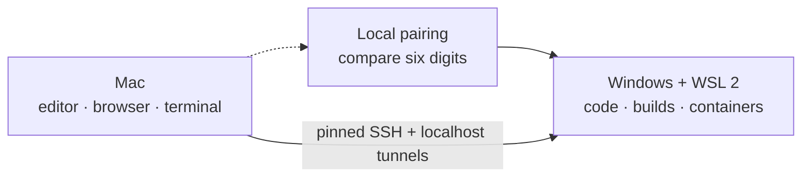

<p align="center">
  
</p>

<h1 align="center">otherhost</h1>

<p align="center"><strong>Make the other host feel local.</strong></p>
<p align="center"><code>localhost → otherhost</code></p>

<p align="center">
  <a href="https://github.com/M3ndes/otherhost/actions/workflows/ci.yml"></a>
  <a href="LICENSE"></a>
</p>

Otherhost turns a Windows desktop into a private WSL 2 development machine for
your Mac. Source code, builds, containers, and databases stay on the more
powerful host while the Mac remains the editor, terminal, and browser.

Pair the computers on your local network, connect through pinned SSH, and work
without a cloud relay, project account, or copied private key.

<p align="center">
  
</p>

<p align="center"><em>The product view uses an intentionally fictional host, projects, terminal output, and hardware.</em></p>

> **Project status:** Otherhost is under active development before `1.0`.
> Portable scripts and the pairing protocol run in CI; complete Windows, WSL,
> and macOS behavior still requires validation on real machines.

## Why Otherhost?

- **Keep the Mac responsive.** Run compilation, containers, databases, and
  other heavy workloads on the Windows host.
- **Work project-first.** Discover WSL repositories and open them with Codex,
  Claude Code, VS Code, or the integrated terminal.
- **See the remote environment.** Inspect CPU, memory, graphics, disks, WSL
  allocation, and project state from a localhost-only dashboard.
- **Stay private.** Use public-key SSH, pinned host identity, encrypted pairing,
  and local-only service tunnels—without a hosted control plane.
- **Keep control.** The CLI, configuration, setup scripts, and protocol are open
  source and intentionally inspectable.

## How it works

The Windows computer is the **host**. It owns WSL, source files, development
tools, and Docker containers. The Mac is the **client** and reaches those
resources through a hardened SSH connection.



Pairing is temporary and installs only the Mac's public SSH key. Daily work uses
the saved, pinned SSH connection. Read [How it works](docs/how-it-works.md) for
the network and trust model in plain language.

## Quick start

You need Windows 11 with WSL 2 and Ubuntu, a Mac with Git and OpenSSH, and both
computers on the same trusted local network during pairing. See the complete
[Windows](docs/windows-wsl.md) and [macOS](docs/macos.md) requirements when
preparing a new machine.

### 1. Prepare Windows

Clone the repository on Windows, open PowerShell in the checkout, and run:

```powershell
.\setup.cmd
```

The command checks the host, shows the planned changes, asks for confirmation,
and configures Windows, WSL, the firewall, and SSH. Use `.\setup.cmd -Check`
for a read-only preflight.

### 2. Install the Mac client

```bash
git clone https://github.com/M3ndes/otherhost.git
cd otherhost
./scripts/bootstrap-mac.sh --apply
```

### 3. Pair once

Start a two-minute discovery window on Windows, then pair from the Mac:

```text
Windows                         Mac
.\setup.cmd -Pair               otherhost pair

Pairing code: 482 731          Pairing code: 482 731
                 compare and confirm
```

Confirm only when the device names and six-digit codes match. If discovery does
not work, follow the [pairing decision guide](docs/troubleshooting.md#otherhost-pair-finds-no-windows-otherhost).

### 4. Connect and work

```bash
otherhost connect
```

Keep that command running to maintain configured localhost tunnels. In another
terminal, open the project dashboard:

```bash
otherhost ui
```

The dashboard runs only on `127.0.0.1:7842`. It discovers primary Git checkouts
inside WSL, opens projects with Codex, Claude Code, or VS Code, provides an
interactive remote shell, and shows the host resources available to development
workloads. See the [dashboard guide](docs/dashboard.md) for its complete behavior
and security boundaries.

To keep the dashboard running across terminal closures and Mac restarts, use
Docker Desktop instead:

```bash
make docker-check
make docker-up
```

The container has an `unless-stopped` restart policy, still publishes only on
Mac loopback, and receives the configuration, dedicated SSH identity, and pinned
known-hosts file as individual read-only mounts. See the
[macOS Docker service](docs/macos.md#keep-the-dashboard-running-with-docker).

## Commands

| Command | Where | Purpose |
| --- | --- | --- |
| `.\setup.cmd` | Windows | Check and configure the Windows + WSL host |
| `.\setup.cmd -Check` | Windows | Run the host preflight without making changes |
| `.\setup.cmd -Pair` | Windows | Make the host discoverable for two minutes |
| `otherhost pair` | Mac | Discover, verify, and save a host |
| `otherhost doctor` | Mac | Validate configuration, keys, dependencies, and SSH |
| `otherhost connect` | Mac | Keep configured SSH port forwards open |
| `otherhost status` | Mac | Show remote uptime, memory, disk, and Docker usage |
| `otherhost urls` | Mac | Print forwarded localhost URLs |
| `otherhost ssh-config [--apply]` | Mac | Review or install the managed SSH host block |
| `otherhost ui` | Mac | Open the project, terminal, and machine dashboard |

## Security and privacy

- Pairing encrypts the exchange and binds it to the six-digit code shown on both
  computers.
- Only the Mac's public SSH key crosses the network; the private key never
  leaves the Mac.
- The authenticated WSL host key is pinned, and SSH password and root login are
  disabled.
- Dashboard, terminal, and forwarded services bind to Mac localhost rather than
  LAN interfaces.
- Configuration is parsed as untrusted data and is never executed as shell or
  PowerShell code.

Do not expose the SSH or pairing ports through a public router. Read the full
[security policy and trust model](SECURITY.md) before changing network or
deployment boundaries.

## Documentation

| Guide | Start here when... |
| --- | --- |
| [How it works](docs/how-it-works.md) | You want the product, network, and trust model in plain language |
| [Windows and WSL host](docs/windows-wsl.md) | You are preparing or operating the Windows computer |
| [macOS client](docs/macos.md) | You are installing, pairing, or using the Mac command |
| [Project dashboard](docs/dashboard.md) | You want project discovery, editor actions, terminal, and machine details |
| [Troubleshooting](docs/troubleshooting.md) | Setup, discovery, SSH, Docker, or the dashboard failed |
| [Migration from devbox-bridge](docs/migration.md) | You installed the project before the Otherhost rename |
| [Architecture](docs/architecture.md) | You want protocol details or plan a code change |
| [Brand](docs/brand.md) | You need the name, voice, logo, or visual tokens |
| [Contributing](CONTRIBUTING.md) | You want to report, test, document, or implement a change |

## Scope

Otherhost creates a trusted remote-development path. It does not install Docker
Desktop, expose the host publicly, synchronize source code or private keys,
provide a cloud relay, manage Windows updates, or replace a private network when
the machines are in different locations.

## Contributing

Issues and focused pull requests are welcome. Redact private keys, tokens,
usernames, hostnames, and LAN addresses from logs, and run `make test` before
submitting code. See [CONTRIBUTING.md](CONTRIBUTING.md) for the complete workflow.

Licensed under the [MIT License](LICENSE).
