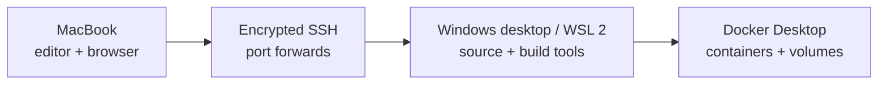

# devbox-bridge

Turn a Windows desktop with WSL 2 and Docker Desktop into a private development
machine that a Mac can use over SSH.

The project is CLI-first: setup stays inspectable, automation works in terminals
and CI, and every machine keeps its own untracked configuration.

## What it provides

- Bluetooth-style local discovery and six-digit device verification;
- a macOS command for health checks, SSH tunnels, URLs, and remote status;
- a PowerShell bootstrap for WSL resources, mirrored networking, and firewall;
- a WSL bootstrap for systemd, hardened SSH, Docker checks, and optional cloning;
- configuration parsed as data, never executed as shell or PowerShell code;
- no passwords, tokens, or private keys committed to Git.



## Requirements

- Mac with Git and OpenSSH;
- Windows 11 22H2 or newer for mirrored WSL networking;
- WSL 2 with an Ubuntu distribution;
- Docker Desktop using the WSL 2 backend for container workloads;
- both devices on the same trusted private network during pairing.

For access away from home, add a private overlay network such as Tailscale later.
Do not expose SSH or pairing ports directly on the public internet.

## 1. Set up the Windows host

Open PowerShell in a Windows checkout of this repository and run:

```powershell
.\setup.cmd
```

The command performs a read-only preflight, asks for one confirmation, requests
Administrator permission through UAC, and prepares Windows, WSL, and hardened
public-key-only SSH. No GitHub account or Mac key is needed during normal host
setup.

### Existing WSL host without elevation

When Ubuntu, systemd, and mirrored networking are already active, the host can
run entirely in the WSL user account without PowerShell, Administrator access,
or `sudo`:

```bash
cd ~/src/devbox-bridge
./scripts/bootstrap-wsl-user.sh --apply
```

This installs OpenSSH from Ubuntu's signed packages under `~/.local`, enables a
user service on port 2222, disables password authentication, and limits SSH port
forwarding to WSL loopback services. It does not install WSL or change Windows
firewall policy.

## 2. Install the Mac client

```bash
git clone https://github.com/M3ndes/devbox-bridge.git
cd devbox-bridge
./scripts/bootstrap-mac.sh --apply
```

The installer adds the `devbox` command and downloads the checksum-verified
pairing helper for the Mac architecture. The dedicated SSH identity is created
on the first pairing. Its private key never leaves the Mac.

## 3. Pair in seconds

On Windows, enable discovery for two minutes:

```powershell
.\setup.cmd -Pair
```

For the user-scoped WSL host, enable discovery inside WSL instead:

```bash
./scripts/pair-wsl.sh
```

Then, on the Mac:

```bash
devbox pair
```

The Mac finds Windows devboxes automatically. It tries multicast first and then
falls back to a bounded scan of its local IPv4 subnet when WSL does not receive
multicast traffic. Both devices display the same six-digit code:

```text
Windows                                  Mac
MacBook-Pro wants to connect.            Found DESKTOP-HOME
Pairing code: 482 731                    Pairing code: 482 731
Does the Mac show the same code?         Does Windows show the same code?
```

Confirm on both devices. Pairing installs the Mac public SSH key, pins the WSL
SSH host identity, saves the Windows address and Ubuntu user, and runs
`devbox doctor`. The code is compared; it is never typed or used as a password.

Pairing mode accepts one active session and closes after success, rejection, or
timeout. Windows-hosted pairing removes its temporary private-subnet firewall
rules; WSL user pairing does not create Windows firewall rules.

## What Windows setup does

- selects a resource policy based on the desktop hardware;
- keeps the operational clone under `~/src/devbox-bridge` inside WSL;
- creates machine-local configuration and detects the Ubuntu user;
- configures mirrored networking and the Hyper-V firewall;
- installs and hardens OpenSSH with password login disabled;
- prepares a permission-restricted `authorized_keys` file for pairing.

The WSL clone is pinned to the exact revision of the Windows checkout. Privileged
WSL configuration runs from that reviewed checkout, and setup refuses local
changes so the scripts match the verified revision.

For a read-only preflight:

```powershell
.\setup.cmd -Check
```

GitHub key discovery remains available as a manual recovery path:

```powershell
.\setup.cmd -GitHubUser YOUR_USER -GitHubKeyFingerprint SHA256:YOUR_FINGERPRINT -Yes
```

## Connect from the Mac

After pairing, the normal daily command is:

```bash
devbox connect
```

Keep it running while using forwarded services. In another terminal:

```bash
devbox urls
devbox status
```

For editors with Remote SSH support, review the generated block before adding it
to `~/.ssh/config`:

```bash
devbox ssh-config
```

## Commands

| Command | Purpose |
| --- | --- |
| `devbox pair` | Discover, verify, and configure a Windows devbox |
| `devbox doctor` | Validate config, dependencies, key permissions, and SSH |
| `devbox connect` | Keep all configured SSH port forwards open |
| `devbox status` | Show remote uptime, memory, disk, and Docker usage |
| `devbox urls` | Print forwarded localhost URLs |
| `devbox ssh-config` | Generate an OpenSSH host block |

Run `make test` before contributing. See [Windows and WSL setup](docs/windows-wsl.md),
[troubleshooting](docs/troubleshooting.md), [macOS usage](docs/macos.md), and
[architecture](docs/architecture.md) for details.

## Scope

This project configures a trusted remote development path. It does not install
Docker Desktop, change router settings, synchronize private keys, or keep a
Windows machine awake. Those remain explicit host-owner decisions.

Licensed under the [MIT License](LICENSE).
