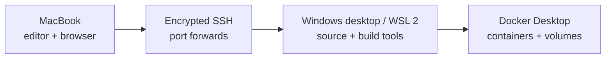

# devbox-bridge

Turn a Windows desktop with WSL 2 and Docker Desktop into a private development
machine that a Mac can use over SSH.

The project is CLI-first: setup stays inspectable, automation works in terminals
and CI, and every machine keeps its own untracked configuration. A graphical UI
may come later, after the setup workflow is stable; it is not required to get a
useful remote devbox.

## What it provides

- a macOS command for health checks, SSH tunnels, URLs, and remote status;
- a PowerShell bootstrap for WSL resources, mirrored networking, and firewall;
- a WSL bootstrap for systemd, hardened SSH, Docker checks, and optional cloning;
- configuration parsed as data, never executed as shell or PowerShell code;
- no passwords, tokens, or private keys committed to Git.



## Requirements

- Mac with Git and OpenSSH;
- Windows 11 22H2 or newer for mirrored WSL networking;
- WSL 2 with an Ubuntu distribution;
- Docker Desktop using the WSL 2 backend;
- both machines on the same trusted network for the first setup.

For access away from home, add a private overlay network such as Tailscale later.
Do not expose the SSH port directly on the public internet.

## Start on the Mac

```bash
git clone https://github.com/M3ndes/devbox-bridge.git
cd devbox-bridge
cp config/devbox.example.conf devbox.local.conf
./scripts/bootstrap-mac.sh --apply --generate-key
```

Edit `devbox.local.conf`. At minimum, set `host`, `ssh_user`, and later
`github_user`. Upload the generated public key to GitHub so the WSL bootstrap can
import it:

```bash
gh ssh-key add ~/.ssh/devbox_bridge_ed25519.pub --title "devbox-bridge Mac"
```

If you do not use GitHub CLI, add the `.pub` file in GitHub's **SSH and GPG
keys** settings. Never upload the private key (the file without `.pub`).

Commit and push only the repository files. `devbox.local.conf` remains local on
each machine, so copy its non-secret values manually when you move to Windows.

## Continue on Windows

First, confirm WSL and the Ubuntu distribution from PowerShell:

```powershell
wsl --version
wsl --list --verbose
```

If Ubuntu is not installed, run `wsl --install -d Ubuntu` and complete its
first-launch user setup. Then install Git and clone the repository into the Linux
filesystem, not under `/mnt/c`:

```bash
# Run inside WSL.
sudo apt-get update
sudo apt-get install -y git
mkdir -p ~/src && cd ~/src
git clone https://github.com/M3ndes/devbox-bridge.git
cd devbox-bridge
cp config/devbox.example.conf devbox.local.conf
whoami
```

Edit `devbox.local.conf`. Set `ssh_user` to the output of `whoami`, set
`github_user`, and adjust the WSL memory and processor limits for the desktop.

From an **Administrator PowerShell**, run the read-only check before applying any
host changes:

```powershell
Set-ExecutionPolicy -Scope Process Bypass
$Distro = "Ubuntu"
$WslUser = (& wsl.exe -d $Distro -- whoami).Trim()
$RepoPath = "\\wsl.localhost\$Distro\home\$WslUser\src\devbox-bridge"

& "$RepoPath\scripts\bootstrap-windows.ps1" `
  -Mode Check `
  -ConfigPath "$RepoPath\devbox.local.conf"
```

Review the report. If the distribution, RAM, processors, and Docker information
are correct, run the same command with `Apply`:

```powershell
& "$RepoPath\scripts\bootstrap-windows.ps1" `
  -Mode Apply `
  -ConfigPath "$RepoPath\devbox.local.conf"
```

Start Docker Desktop and Ubuntu again after WSL is shut down. Inside WSL, check
first and then apply:

```bash
cd ~/src/devbox-bridge
./scripts/bootstrap-wsl.sh
./scripts/bootstrap-wsl.sh --apply
```

The first WSL run may enable systemd and ask for one more `wsl --shutdown`.
Docker Desktop must have integration enabled for the selected distribution.

The Windows side is ready when all of these are true:

1. `wsl --list --verbose` shows Ubuntu using WSL 2.
2. `docker info` works inside Ubuntu.
3. `systemctl is-active ssh` prints `active`.
4. `ss -lnt | grep 2222` shows the SSH listener.
5. `devbox doctor` succeeds from the Mac after its `host` value is set.

## Connect from the Mac

Use the desktop's Windows LAN address in `host`, then:

```bash
devbox doctor
devbox connect
```

Keep `devbox connect` running. Services on the configured ports are now available
through `localhost` on the Mac. In another terminal:

```bash
devbox urls
devbox status
```

For editors with Remote SSH support, review the generated block before adding it
to `~/.ssh/config`:

```bash
devbox ssh-config
```

## Commands

| Command | Purpose |
| --- | --- |
| `devbox doctor` | Validate config, dependencies, key permissions, and SSH |
| `devbox connect` | Keep all configured SSH port forwards open |
| `devbox status` | Show remote uptime, memory, disk, and Docker usage |
| `devbox urls` | Print forwarded localhost URLs |
| `devbox ssh-config` | Generate an OpenSSH host block |

Run `make test` before contributing. See [Windows and WSL setup](docs/windows-wsl.md),
[troubleshooting](docs/troubleshooting.md), [macOS usage](docs/macos.md), and
[architecture](docs/architecture.md) for details.

## Scope

This project configures a trusted remote development path. It does not install
Docker Desktop, change router settings, synchronize private keys, or keep a
Windows machine awake. Those remain explicit host-owner decisions.

Licensed under the [MIT License](LICENSE).
