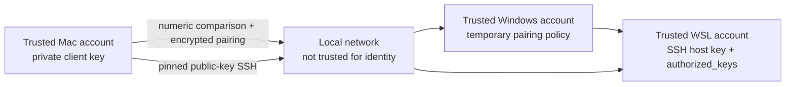

# Security policy

otherhost configures an authenticated development path between computers
you control. It reduces common setup risks, but it is not a general-purpose VPN,
internet gateway, endpoint-security product, or substitute for operating-system
hardening.

## Supported versions

Security fixes target the latest published release and the default branch. Older
tags may not receive patches. When reporting a problem, include the release tag
or Git revision without including secrets or identifying network data.

## Reporting a vulnerability

Use the repository's private **Report a vulnerability** form under the GitHub
**Security** tab. Do not open a public issue for a suspected vulnerability.

Include, when available:

- the affected revision or release;
- the affected Windows, WSL, or macOS component;
- prerequisites and a minimal reproduction;
- the security property that fails and its likely impact;
- whether the issue was reproduced with the default configuration.

Do not include real private keys, tokens, passwords, project secrets, public IP
addresses, or data belonging to another person. Use newly generated test
credentials if a proof of concept needs key material.

## Trust model

The intended deployment has one owner or mutually trusted users controlling the
Mac, Windows account, and WSL account. Initial pairing happens while both devices
are reachable on a trusted local network. Daily access uses public-key-only SSH.

The local network transports messages but is not trusted to identify either
device. During pairing, users establish that identity by comparing the device
name and the independently derived six-digit value on both screens. During daily
use, cryptographic keys remembered from pairing identify the client and host.

## Security properties

The default design intends to preserve these properties:

- **No private-key transfer.** The Mac private SSH key and WSL private host key
  remain on the machines that created them.
- **Human verification at both devices.** The operator must approve the same
  device names and six-digit comparison value on both screens.
- **Authenticated key exchange.** Pairing data after verification travels in
  authenticated encrypted messages derived from fresh ephemeral keys.
- **Host identity continuity.** The Mac pins the WSL Ed25519 host key and uses
  strict host-key checking for subsequent SSH connections.
- **Public-key-only remote login.** SSH password login and root login are
  disabled, and effective hardening is checked before the service is enabled.
- **Minimal network exposure.** Pairing listeners are temporary and scoped to
  the local network. Application tunnels bind to Mac loopback by default.
- **Explicit privilege.** Read-only checks precede changes; Windows
  administrator access is requested through UAC only for system policy.
- **Reviewed bootstrap revision.** The WSL operational clone is pinned to the
  exact clean revision launched from Windows before privileged setup runs.
- **Configuration is data.** Machine-local config is validated and never
  evaluated as Bash or PowerShell code.
- **Local terminal authorization.** Browser terminals require the per-process
  dashboard token, exact same-origin checks, and a short-lived, one-use
  WebSocket authorization that is not placed in the URL.
- **Explicit destructive actions.** Project deletion requires the dashboard
  token, same-origin validation, an exact current inventory path, typed project
  name confirmation, canonical containment below the WSL home, a primary Git
  checkout, and a non-mounted target.

See [Architecture and decisions](docs/architecture.md) for protocol and boundary
details.

## What numeric comparison does not protect

The six-digit value is not a password, recovery code, or authentication secret.
It is a short human comparison derived independently from the pairing
transcript. Its protection depends on rejecting a mismatch and rejecting an
unexpected device.

Numeric comparison does not protect against:

- malware or an attacker already controlling either computer or user account;
- a user approving different or unexpected codes without comparing them;
- theft of an unlocked device or an unencrypted disk;
- vulnerable applications exposed through an SSH tunnel;
- secrets committed to a project or printed by application logs;
- future access when an authorized Mac private key is stolen.

Remove a lost or untrusted Mac's public key from WSL `authorized_keys` and pair a
replacement identity. Investigate an unexpected WSL host-key change instead of
disabling strict host-key verification.

## Safe deployment boundaries

- Use the project only on machines and accounts you control.
- Pair on a trusted home or office network. Confirm both the requesting device
  name and all six digits on both screens.
- Never forward UDP `25370`, TCP `25371`, or the SSH port from a public router.
- For use across different networks, add a private overlay network or VPN after
  local operation is verified and review its own access policy.
- Keep Windows, WSL, macOS, OpenSSH, Docker Desktop, and project dependencies
  patched.
- Enable disk encryption, screen locking, and appropriate account protection on
  both computers.
- Never commit `otherhost.local.conf`, `.env` files, tokens, passwords, or private
  SSH keys. Only `.pub` keys are shareable.
- Review generated SSH, WSL, and firewall configuration before applying it in a
  sensitive environment.
- Keep Docker and application services bound as narrowly as practical. An SSH
  tunnel protects transport; it does not fix an insecure application.
- Treat the integrated terminal like any other shell logged into WSL. It is not
  sandboxed and can read, change, or delete anything available to the paired
  WSL account. Lock the Mac when unattended and close unused sessions.
- Treat **Delete permanently** like running `rm -rf` in WSL. Otherhost does not
  retain a trash copy; push or back up work before confirming the project name.

The setup scripts preserve unrelated configuration and back up `.wslconfig`
before changing it. Host owners remain responsible for backups, recovery,
physical security, power policy, and the availability of their workloads.

## Diagnostic data

`[diag]` output is designed not to print private SSH keys, ephemeral pairing
keys, or application secrets. It can still contain device names, usernames,
executable paths, local subnets, and addresses.

The Windows pairing transcript under
`%LOCALAPPDATA%\otherhost\logs\pairing-latest.log` captures the complete
console session and can also contain the temporary comparison code. Review and
redact diagnostic output before sharing it publicly.
