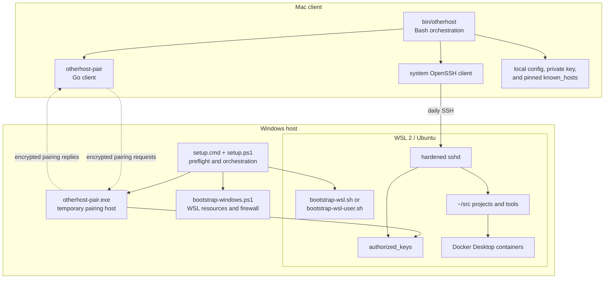
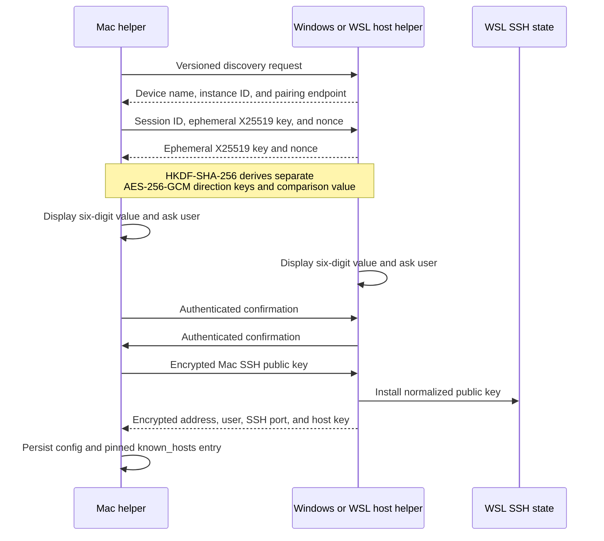
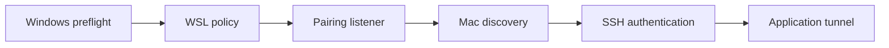

# Architecture and decisions

This document describes the system boundaries and design constraints for
contributors. For a less technical introduction, start with
[How otherhost works](how-it-works.md).

## Design goals

otherhost aims to make a Windows + WSL development host feel simple from a
Mac without hiding important security or system changes.

The implementation favors:

- a fast, human-verifiable local pairing flow;
- standard OpenSSH for persistent access;
- local operation with no hosted relay or account service;
- small, inspectable Bash and PowerShell entry points;
- idempotent setup that preserves unrelated user configuration;
- inert machine-local configuration rather than executable config files;
- useful diagnostics at each Windows, WSL, network, SSH, and Docker boundary.

## Components

`setup.cmd` is a thin Windows entry point. `setup.ps1` performs preflight,
revision verification, UAC handoff, and orchestration. Lower-level Windows and
WSL bootstraps remain callable for diagnostics and manual recovery.

`bin/otherhost` is the Mac-facing control plane. It parses configuration, invokes
the pairing helper, validates local state, and constructs explicit OpenSSH
commands. The Go helper owns only discovery and the short-lived cryptographic
pairing protocol; it is not part of daily SSH connections.

## Why CLI first

A terminal interface makes every host change reviewable, works over remote or
recovery sessions, and keeps diagnostics available in CI. A future graphical
interface can call the same primitives, but security policy and recovery must
not depend on a GUI.

The project targets the system Bash available on supported macOS releases and
Windows PowerShell 5.1. The Go pairing helper has no third-party Go module
dependencies, reducing the release and audit surface.

## Project dashboard

`otherhost ui` starts a small Go HTTP server bound exclusively to `127.0.0.1`; it
does not replace the CLI or listen on a LAN address. The embedded frontend has
no CDN dependencies or telemetry. Xterm.js and its fit addon are vendored with
their licenses. The server reads a bounded inventory over the existing pinned
SSH connection and treats `otherhost.local.conf` as data.

The dashboard's primary model is a remote project, not an infrastructure
service. Windows and WSL provide compute capacity; the Mac presents the editor,
browser, and interaction layer. Host specifications support capacity decisions,
while Docker details remain in explicit CLI diagnostics or future
project-specific views.

Project discovery is bounded to the WSL user's home: the inventory scans at
most three directory levels, prunes hidden directories and dependency trees,
and returns at most 200 Git repositories. Direct children of the configured
`projects_root` are also scanned so a deliberately deeper project root remains
usable. Windows mounts and the rest of the remote filesystem are never walked.
Candidates must own a `.git` directory; `.git` pointer files used by standard
submodules and linked worktrees are deliberately omitted in favor of their
primary checkout. The operational source checkout is identified by the official
Otherhost Git remote and omitted as infrastructure rather than presented as a
user project. Both the current `otherhost` and legacy `devbox-bridge` GitHub URLs
are recognized so hosts can be upgraded independently of the dashboard client.
The browser refreshes the full inventory every 30 seconds while visible, when
its tab returns to the foreground, and when the user opens Projects.

Local actions use a per-process random token and same-origin validation. A
project can be opened or deleted only when its exact remote path appeared in the
latest SSH inventory. This prevents another local website from turning the
dashboard into an arbitrary command launcher. Requests with a non-loopback HTTP
`Host` are rejected to prevent DNS rebinding from bypassing that local boundary.
Before launching VS Code, the Mac resolves the selected Remote SSH alias with
`ssh -G` and verifies its host, user, port, identity, and pinned host-key file
against the parsed Otherhost configuration. Pairing offers to install the same
managed alias, while `otherhost ssh-config --apply` can replace it idempotently
without evaluating the local configuration or modifying unrelated SSH entries.

Deletion is intentionally permanent. The browser shows the complete path and
requires the exact project name before sending the request. The server removes
the path from its action allowlist while deletion is in progress and rejects a
second request for the same project. The remote command receives the path as
base64-encoded data, resolves both it and `$HOME` physically, requires the
canonical project to be below that home, requires an owned `.git` directory,
rejects mount points, changes back to `$HOME`, and only then executes
`rm -rf -- "$resolved"`. A failed command restores server authorization for a
retry; a successful command verifies that the directory no longer exists.

The integrated terminal creates a local PTY whose child is the system OpenSSH
client. OpenSSH reuses the configured identity, pinned `known_hosts` file,
strict host-key checking, and keepalives; the remote side starts the WSL user's
login shell. A project terminal may start only at an exact path from the latest
inventory. A general terminal intentionally starts in the WSL home directory.
After login it is a normal shell, not a filesystem sandbox, so the user can
navigate anywhere their WSL account is permitted to access.

The login shell starts without the `SSH_CLIENT`, `SSH_CONNECTION`, and
`SSH_TTY` marker variables. Prompt themes therefore render like a local WSL
terminal instead of repeating `user@host` inside an interface that already
identifies the remote machine. This changes only the child environment; the
PTY transport, authentication, host verification, and process lifecycle remain
SSH-backed.

After an interactive Zsh is ready, the PTY submits a constant initialization
command that wraps Powerlevel10k's final `precmd` renderer and clears
`RPROMPT`/`RPS1` after each render. Other Zsh themes receive a final `precmd`
hook with the same effect. This keeps right-side timestamps from colliding
visually with typed commands in the embedded terminal. The command then clears
the initial setup line from the display. It does not write to `.zshrc`,
`.p10k.zsh`, or any other remote file, and non-Zsh shells retain their configured
prompt.

The browser does not stream bootstrap bytes into Xterm.js immediately. It
buffers them until the initialization command emits its final clear-screen
sequence, treats that sequence as the ready marker, discards everything before
it, and renders only the actual interactive prompt and later output. Keyboard
input remains disabled during this short preparation window, preventing user
commands from interleaving with session setup. A bounded buffer and timeout turn
a missing marker into a visible initialization error instead of leaving the
browser waiting indefinitely.

Creating a terminal requires the dashboard action token and a same-origin POST.
The response contains a random authorization valid for 30 seconds and one
WebSocket attachment. Its secret is sent as a WebSocket subprotocol rather than
in the URL, keeping it out of ordinary request logs. The socket repeats the
loopback `Host` and exact `Origin` checks, bounds input messages and terminal
dimensions, and limits the process to four pending or active sessions. Closing
the socket, page, or dashboard closes the PTY and terminates the SSH child.

## Pairing protocol

Pairing uses numeric comparison rather than a shared password.

The flow is:

1. `setup.cmd -Pair` opens one TCP and one UDP Windows Firewall rule for the
   active private local subnet, or `scripts/pair-wsl.sh` listens directly in an
   existing mirrored-network WSL user session. Either mode is discoverable for
   two minutes.
2. `otherhost pair` sends a versioned IPv4 multicast request. If no compatible
   reply arrives, it probes the fixed pairing TCP port on a bounded set of
   addresses in the Mac's local IPv4 subnet and accepts only protocol-valid
   responses.
3. The devices exchange fresh X25519 public keys and 256-bit random nonces.
4. Both derive separate AES-256-GCM direction keys and a six-digit comparison
   value from the complete transcript with HKDF-SHA-256.
5. The operator must confirm the same device identity and comparison value on
   both screens.
6. Only after confirmation does the Mac send its public SSH key in an
   authenticated encrypted message.
7. The host installs that public key and returns authenticated connection data,
   including its WSL Ed25519 SSH host key.
8. The Mac pins that host key before the first OpenSSH connection.

The six digits are never transmitted. They bind the device names, discovery
instance, session identifier, ephemeral keys, and nonces. An active
man-in-the-middle has approximately a one-in-one-million chance per
user-approved attempt of presenting a matching value. This property depends on
the user rejecting a mismatched code or unexpected device.

The public product identifiers changed to Otherhost after protocol v1 shipped.
The v1 discovery magic, transcript label, HKDF labels, and encrypted JSON field
names intentionally retain their original values. They are wire identifiers,
not user-facing branding, and keeping them stable lets upgraded clients pair
with already-installed v0.1.1 Windows and WSL helpers.

Pairing permits one active session and closes after success, rejection, error,
or timeout. A discovered endpoint reveals only the temporary instance, device
name, and pairing port. Windows mode limits temporary firewall rules to the
helper executable, active network profile, and active IPv4 subnet, then removes
them in a `finally` path. It does not change the network category. Direct WSL
user mode creates no Windows Firewall rules.

## Network surfaces

| Surface | Default | Exposure | Lifecycle |
| --- | --- | --- | --- |
| Multicast discovery | UDP `239.255.67.89:25370` | Local multicast scope | Pairing window only |
| Direct discovery and pairing | TCP `25371` | Active local IPv4 subnet | Pairing window only |
| WSL SSH | TCP `2222` | Allowed local subnet through Hyper-V firewall | Persistent host service |
| Forwarded applications | Configured ports such as `3000` | Mac `127.0.0.1` only | While `otherhost connect` runs |
| Project dashboard | TCP `7842` | Mac `127.0.0.1` only | While `otherhost ui` runs |

The fixed pairing ports remain below common ephemeral ranges so mirrored WSL
networking cannot reserve them for outbound connections. Neither pairing nor SSH
ports should be forwarded from a public router.

Windows mirrored networking gives WSL direct LAN reachability. The elevated
bootstrap adds one inbound Hyper-V firewall rule for the configured SSH port.
SSH accepts public-key authentication only, rejects root login, and uses the
host identity pinned during pairing.

On a host where mirrored networking and inbound policy already permit WSL LAN
traffic, `bootstrap-wsl-user.sh` extracts Ubuntu's signed OpenSSH packages into
the user home and runs `sshd` as a systemd user service on an unprivileged port.
That mode requires neither Windows elevation nor Linux `sudo`; it restricts
forwarding destinations to WSL loopback addresses.

## Source and compute location

Projects live inside the WSL Linux filesystem, normally under `~/src`. The
dashboard scans only direct Git repository children of the configured
`projects_root`. Builds, dependency installation, Git operations, databases,
and containers run on the desktop. The Mac remains the interactive client.

This is important for Docker Compose bind mounts: a remote Docker engine alone
is insufficient because source paths must exist beside the engine. Keeping
Linux workloads out of `/mnt/c` also avoids cross-filesystem metadata and I/O
penalties.

## Configuration and persistent state

`otherhost.local.conf` is a portable `key=value` file. Bash and PowerShell parse it
as inert text. Values are deliberately limited to plain strings; quoting,
variable expansion, and command substitution are unsupported.

Each clone owns an ignored local config. The repository contains only
`config/otherhost.example.conf` as a documented template.

| State | Owner | Security property |
| --- | --- | --- |
| `otherhost.local.conf` | Each machine | Ignored by Git; treated as untrusted input |
| Mac private SSH key | Mac | Mode-restricted and never transmitted |
| Mac public SSH key | Mac, then WSL | Explicitly safe to share; installed only after confirmation |
| WSL SSH host private key | WSL | Never returned to the Mac |
| Pinned WSL host public key | Mac | Enforces strict host-key verification |
| `.wslconfig` | Windows user | Unrelated content preserved; backup created before changes |
| Windows pairing transcript | Windows user profile | Diagnostic data; may identify devices, paths, addresses, and code |

Secure pairing is the default key exchange. Windows can discover public keys
from an explicitly selected GitHub profile only as a manual recovery route; it
authorizes only the user-confirmed fingerprint. Private keys and application
secrets never belong in project configuration.

## Revision and privilege boundary

The Windows launcher records its exact clean Git revision and pins the
operational WSL clone to it. Privileged WSL configuration runs from the reviewed
Windows checkout that launched setup. Setup refuses local changes so a stale or
modified second checkout cannot silently become the code source at the `sudo`
boundary.

This constraint means contributors testing host changes should commit them on a
branch before exercising the full Windows launcher. Local helper binaries are
used only through the explicit `OTHERHOST_PAIR_BIN` development override.

## Failure model

Diagnostics should identify the failing boundary without printing secret
material:

Each arrow is independently testable. Changes should preserve this separation:
do not turn a network timeout into an authentication error, silently fall back
from strict host-key checking, or bypass a failed policy check. See
[Troubleshooting](troubleshooting.md) for the operator-facing checks.

## Intentionally out of scope

The current architecture does not provide NAT-mode WSL proxies, internet relay,
account management, key synchronization, project synchronization, remote wake,
or automatic VPN setup. These features require separate threat models and
should not be smuggled into the local pairing path as incidental behavior.
