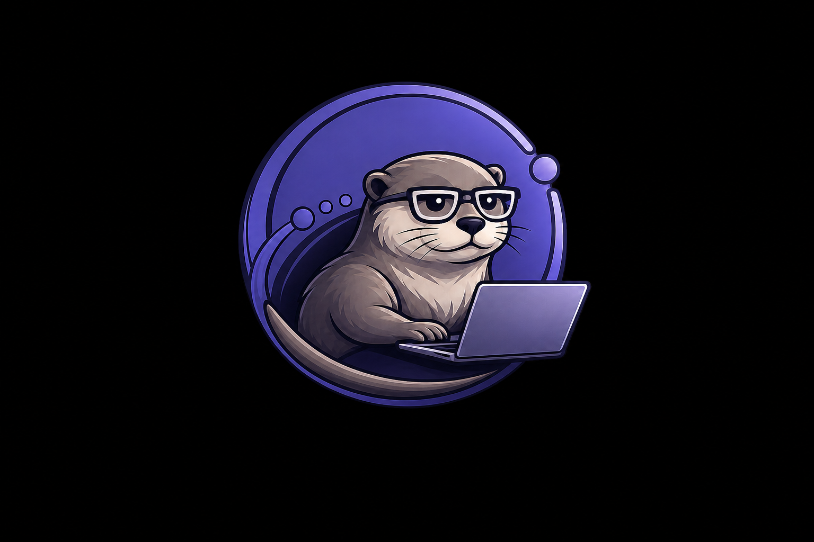

# Otherhost brand

Otherhost is a calm bridge between the computer in front of you and the one
doing the heavy work elsewhere. Its identity should feel capable and technical
without looking like infrastructure that demands constant attention.

## Name and voice

- Product name in prose: **Otherhost**.
- CLI, package, repository, and wordmark: `otherhost`.
- Primary promise: **Make the other host feel local.**
- Technical signature: `localhost → otherhost`.
- Developer line for informal contexts: **Localhost has backup.**

Copy is direct, quiet, and specific. Prefer familiar words such as “machine,”
“project,” and “connection” over platform jargon when both are accurate. The
interface and public documentation use English.

## Otter and orbital mark

The Otherhost mascot is an otter working from a laptop inside an incomplete
orbit. The otter makes the project approachable and represents the developer at
the controls; the orbit still communicates the connection to another machine.
The laptop is deliberately unbranded so the identity remains independent of a
hardware vendor.

The detailed mascot is for the README, project pages, announcements, and other
surfaces where it has room to breathe. Do not use it below 160 CSS pixels or
place it on a background lighter than `#111116`.

For product surfaces, use [the square icon crop](assets/otherhost-icon.png). It is
the same illustration, tightly framed so the otter, laptop, and orbit remain
visible in the dashboard navigation and favicon. Keep clear space around the
square equal to one orbit node. Do not redraw the otter, remove the glasses,
add device-vendor marks, or place another symbol over the illustration.

The desktop dashboard uses a mascot-first lockup inspired by developer-tool
navigation: the square icon appears at 104 CSS pixels above the `otherhost`
wordmark, followed by the primary menu. The mobile header uses the same icon in
a compact horizontal lockup. This size hierarchy gives the mascot personality
without repeating it elsewhere in the page.

| Asset | Intended use |
| --- | --- |
| `docs/assets/otherhost-mascot.png` | README, project pages, and community artwork |
| `docs/assets/otherhost-icon.png` | Wordmark lockups, compact documentation, and social avatars |
| `internal/dashboard/assets/favicon.png` | Browser favicon and dashboard navigation |
| `internal/dashboard/assets/vscode.svg` | Unmodified official stable VS Code icon for the editor action |
| `◉  otherhost` | Text-only CLI signature; never substitute terminal art for the image mark |

Third-party product actions use the vendor's published artwork without
redrawing or recoloring it. The VS Code action uses Microsoft's stable icon and
approved `VS Code` name; it is not part of the Otherhost identity.

## Visual system

| Role | Color | Hex |
| --- | --- | --- |
| Orbital violet | Primary action and identity | `#6d5dfc` |
| Deep violet | Gradient endpoint and emphasis | `#5b49e8` |
| Quiet orbit | Large illustrated surfaces | `#7568dc` |
| Orbit shadow | Small-mark depth | `#5144b8` |
| Quiet ink | Primary light-theme text | `#17171b` |
| Night | Dark-theme background | `#111116` |
| Signal green | Healthy private connection | `#18845c` |

The product uses generous space, restrained glass surfaces, compact status
signals, and a neutral system-font stack. Motion should explain a state change,
not decorate idle screens. The visual language is named **Orbital**; Otherhost
is the product name.
