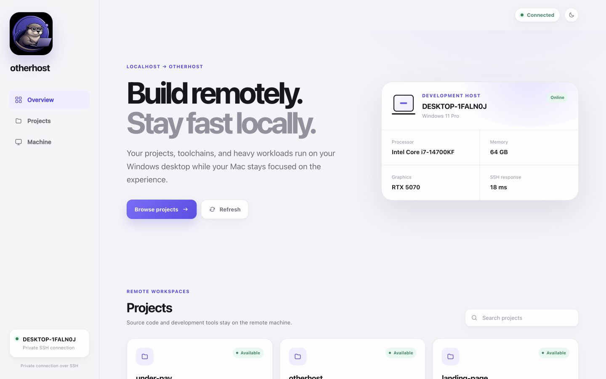
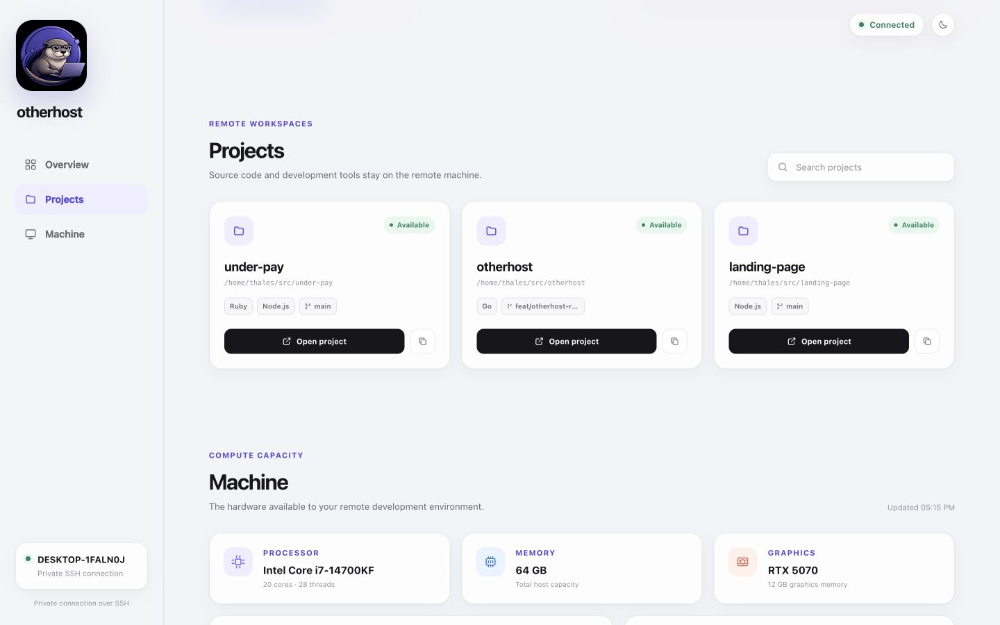
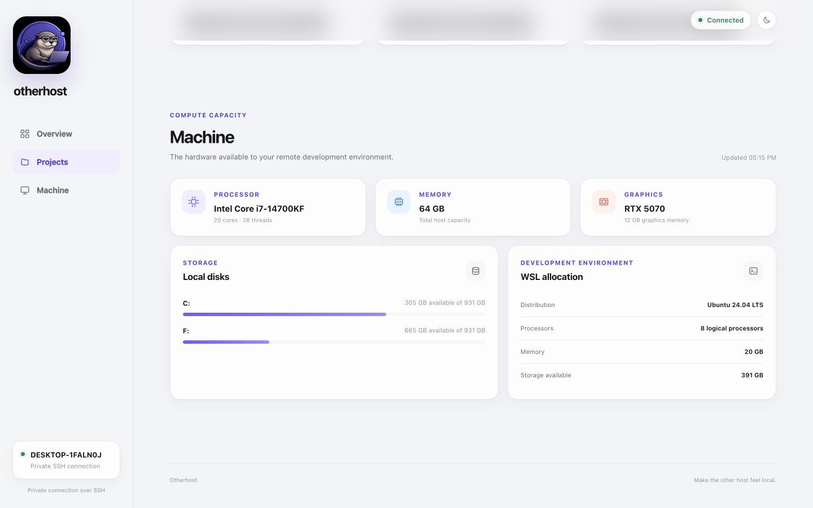
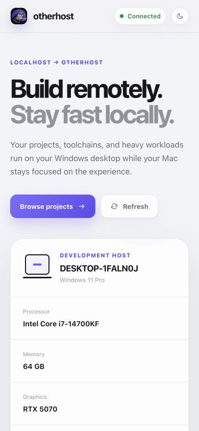

# Project dashboard

The Otherhost dashboard gives the Mac a local view of projects and compute
capacity on the connected Windows and WSL host. It remains an optional layer
over the CLI: pairing, diagnostics, recovery, and SSH continue to work without
the browser interface.



All screenshots on this page use fixed values from the built-in demonstration
mode rather than querying a connected machine.

## Start the dashboard

After pairing and adding the reviewed output from `otherhost ssh-config` to
`~/.ssh/config`, run:

```bash
otherhost ui
```

The command starts a local server on `127.0.0.1:7842` and opens it in the
default browser. Closing the command stops the dashboard. It does not start a
project application or replace the tunnels managed by `otherhost connect`.

## Overview

Overview answers the first two questions in a remote development session:
whether the host is reachable and whether it has the capacity for the next
workload. It presents the Windows identity, operating system, processor,
memory, graphics hardware, and current SSH response time without treating
Docker as the primary health signal.

The status shown in the top bar and sidebar comes from the same bounded SSH
inventory used by the rest of the page. When that inventory fails, the page
keeps the last layout stable and presents a retry action with a concise error.

## Projects



Projects lists direct Git repository children of the configured `projects_root`
inside WSL. Each card shows the repository name, remote path, detected
technologies, and current Git branch.

- **Open project** asks the local VS Code CLI to open the exact inventoried path
  through the configured Remote SSH alias.
- **Open in terminal** starts an interactive WSL shell at the exact inventoried
  project path inside the dashboard.
- **Copy path** copies the Linux path for use in a terminal or another editor.
- **Search projects** filters the inventory already loaded in the page; it does
  not send the query to the host or an external service.

The dashboard never accepts an arbitrary path from the browser. A project can
be opened only when its exact path appeared in the latest server-side
inventory.

## Terminal


Terminal keeps the shell interaction on the Mac while commands and workloads
run inside WSL. **Start terminal** and **New session** begin in the remote WSL
home directory. The terminal icon on a project card begins in that repository.
Once connected, the shell can navigate the rest of the remote machine with the
normal permissions of the paired WSL user.

Each session uses the same configured SSH identity and pinned host key as the
inventory. **Close**, closing the page, or stopping `otherhost ui` terminates
the local PTY and its SSH process. Starting a new session replaces the current
one in that browser page.

The screenshot shows the disconnected empty state because demonstration mode
intentionally never starts a local or remote shell.

## Machine



Machine separates physical host capacity from the resources available to the
WSL development environment:

- processor model, physical cores, and logical processors;
- host memory and graphics memory;
- Windows disk capacity and available space;
- WSL distribution, processor allocation, memory, and available Linux storage.

This distinction helps diagnose whether a workload is constrained by the
desktop itself or by the current WSL allocation.

## Responsive layout

<p align="center">
  
</p>

On narrow screens, the fixed sidebar becomes a compact top header while the
same status, project, and machine information remains available in a single
column. The terminal adapts its rows and columns to the available viewport. The
dashboard supports light and dark system preferences and respects reduced-motion
settings.

## Privacy and security boundaries

- The HTTP server binds only to Mac loopback, never to the LAN.
- The frontend loads no CDN scripts, fonts, images, or analytics.
- Inventory travels through the existing pinned SSH connection.
- Mutating actions require a per-process random token and a same-origin request.
- Non-loopback HTTP hosts are rejected to reduce DNS-rebinding risk.
- Project launches are restricted to paths from the latest inventory.
- Terminal creation requires the dashboard action token and same-origin POST.
- WebSocket authorization is random, valid for 30 seconds, consumed on first
  connection, and carried outside the URL.
- At most four terminal sessions may be pending or active at once.

The dashboard is a trusted local control surface, not a hosted account or
public administration panel. Its terminal is a normal WSL shell, not a sandbox.
For the full reasoning and threat boundaries, see [Architecture and
decisions](architecture.md) and the [security policy](../SECURITY.md).

## Run with demonstration data

Contributors can inspect the interface without a Windows host:

```bash
make build-ui
./build/otherhost-ui --demo --no-open
```

Then open `http://127.0.0.1:7842`. Demonstration mode uses fixed sample projects
and hardware data, performs no SSH connection, and keeps terminal actions
disabled.
