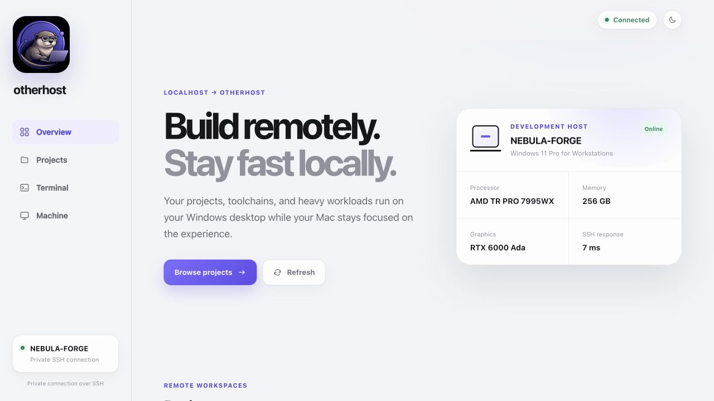
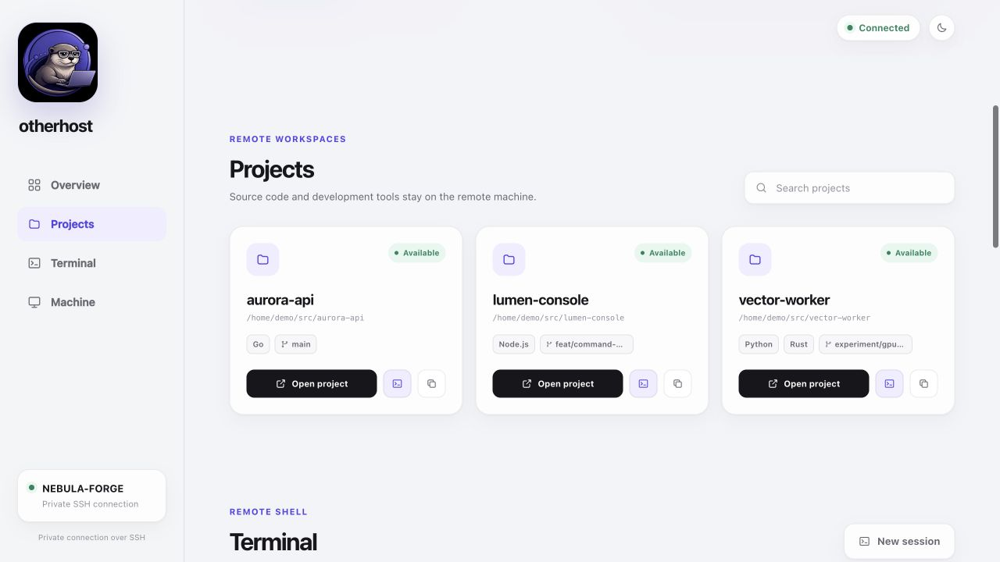
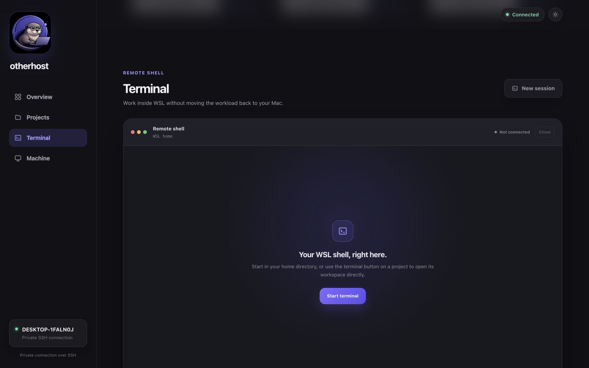
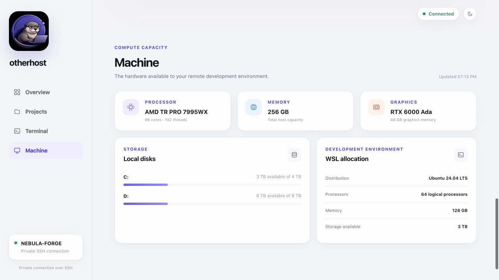

# Project dashboard

The Otherhost dashboard gives the Mac a local view of projects and compute
capacity on the connected Windows and WSL host. It remains an optional layer
over the CLI: pairing, diagnostics, recovery, and SSH continue to work without
the browser interface.



All screenshots on this page are captured from the built-in demonstration mode.
The host, hardware, usernames, paths, projects, terminal commands, and command
output are intentionally fictional; capturing documentation never queries a
connected machine.

## Start the dashboard

After pairing, accept the managed Remote SSH host entry or install it later with
`otherhost ssh-config --apply`. Then run:

```bash
otherhost ui
```

The command starts a local server on `127.0.0.1:7842` and opens it in the
default browser. Closing the command stops the dashboard. It does not start a
project application or replace the tunnels managed by `otherhost connect`.

## Overview

Overview answers the first two questions in a remote development session:
whether the host is reachable and whether it has the capacity for the next
workload. It presents the Windows identity, operating system, processor,
memory, graphics hardware, and current SSH response time without treating
Docker as the primary health signal.

The status shown in the top bar and sidebar comes from the same bounded SSH
inventory used by the rest of the page. When that inventory fails, the page
keeps the last layout stable and presents a retry action with a concise error.

## Projects



Projects automatically discovers Git repositories within three directory
levels of the WSL user's home. The configured `projects_root` remains the
preferred location and its direct children are always included, even when that
root is deeper in the home directory. Hidden directories, `node_modules`,
`vendor`, and paths outside the WSL home such as Windows mounts are not scanned.
Git submodules and linked worktrees are omitted because their `.git` entry
points to the primary checkout instead of owning repository metadata. The
Otherhost source checkout used to install and maintain the host is operational
tooling rather than a user workspace, so repositories whose origin is the
official `otherhost` repository or its former `devbox-bridge` URL are omitted.
The bounded inventory returns at most 200 primary repositories. Each card shows
the repository name, remote path, detected technologies, and current Git branch.

The visible dashboard refreshes its inventory every 30 seconds. Returning to
the browser or opening **Projects** triggers an immediate refresh, so a
repository cloned from the general terminal in the WSL home appears without a
restart or manual move.

- **Open in VS Code** asks the local VS Code CLI to open the exact inventoried path
  through the configured Remote SSH alias. The alias must match the paired host,
  user, port, pinned host-key file, and identity; otherwise the action explains
  how to repair it with `otherhost ssh-config --apply` before VS Code starts.
- **Open in terminal** starts an interactive WSL shell at the exact inventoried
  project path inside the dashboard.
- **Copy path** copies the Linux path for use in a terminal or another editor.
- **Delete project** opens a destructive-action dialog with the full remote
  path. The user must type the exact project name before **Delete permanently**
  is enabled. Confirmation recursively removes the entire directory from WSL;
  it does not use a trash folder and cannot be undone by Otherhost.
- **Search projects** filters the inventory already loaded in the page; it does
  not send the query to the host or an external service.

The dashboard never accepts an arbitrary path from the browser. A project can
be opened or deleted only when its exact path appeared in the latest
server-side inventory. Failed deletions leave the card authorized for a retry;
successful deletions remove it immediately and refresh the remote inventory.
Back up or push any work that must be retained before confirming deletion.

## Terminal



Terminal keeps the shell interaction on the Mac while commands and workloads
run inside WSL. **Start terminal** and **New session** begin in the remote WSL
home directory. The terminal icon on a project card begins in that repository.
Once connected, the shell can navigate the rest of the remote machine with the
normal permissions of the paired WSL user.

Each session uses the same configured SSH identity and pinned host key as the
inventory. **Close**, closing the page, or stopping `otherhost ui` terminates
the local PTY and its SSH process. Starting a new session replaces the current
one in that browser page. The child shell omits OpenSSH's connection marker
variables so prompt themes render like a local WSL terminal instead of adding a
redundant `user@host` segment. For Zsh themes such as Powerlevel10k, the session
also clears the right prompt so timestamps do not compete with the command text.
These overrides are session-only; the user's Zsh and Powerlevel10k files remain
unchanged, and the transport itself remains SSH. The browser buffers the
bootstrap output until the session emits its ready marker, so internal setup
commands never appear in the terminal viewport.

In demonstration mode, starting a terminal opens a read-only scripted preview
with fictional commands and output. It exercises the same terminal presentation
without launching a local process or connecting to WSL over SSH.

## Machine



Machine separates physical host capacity from the resources available to the
WSL development environment:

- processor model, physical cores, and logical processors;
- host memory and graphics memory;
- Windows disk capacity and available space;
- WSL distribution, processor allocation, memory, and available Linux storage.

This distinction helps diagnose whether a workload is constrained by the
desktop itself or by the current WSL allocation.

## Responsive layout

On narrow screens, the fixed sidebar becomes a compact top header while the
same status, project, and machine information remains available in a single
column. The terminal adapts its rows and columns to the available viewport. The
dashboard supports light and dark system preferences and respects reduced-motion
settings.

## Privacy and security boundaries

- The HTTP server binds only to Mac loopback, never to the LAN.
- The frontend loads no CDN scripts, fonts, images, or analytics.
- Inventory travels through the existing pinned SSH connection.
- Mutating actions require a per-process random token and a same-origin request.
- Non-loopback HTTP hosts are rejected to reduce DNS-rebinding risk.
- Project launches are restricted to paths from the latest inventory.
- Project deletion additionally requires the exact project name, revalidates
  that the canonical remote path is a primary Git checkout below the WSL home,
  rejects mount points, and prevents concurrent deletion of the same path.
- Terminal creation requires the dashboard action token and same-origin POST.
- WebSocket authorization is random, valid for 30 seconds, consumed on first
  connection, and carried outside the URL.
- At most four terminal sessions may be pending or active at once.

The dashboard is a trusted local control surface, not a hosted account or
public administration panel. Its terminal is a normal WSL shell, not a sandbox.
For the full reasoning and threat boundaries, see [Architecture and
decisions](architecture.md) and the [security policy](../SECURITY.md).

## Run with demonstration data

Contributors can inspect the interface without a Windows host:

```bash
make build-ui
./build/otherhost-ui --demo --no-open
```

Then open `http://127.0.0.1:7842`. Demonstration mode uses an intentionally
fictional host, sample projects under `/home/demo`, and a scripted read-only
terminal preview. It never opens an SSH connection or runs the displayed
commands.
