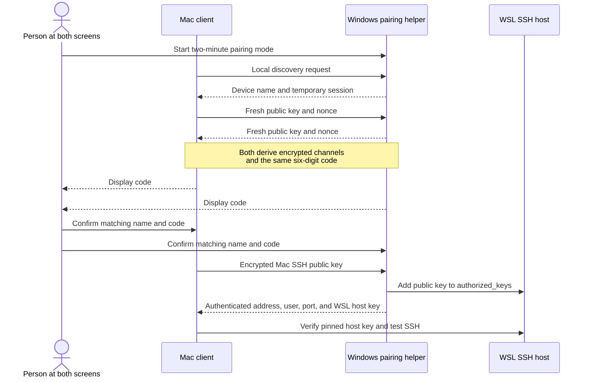
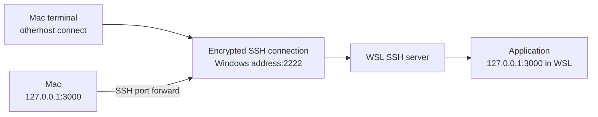
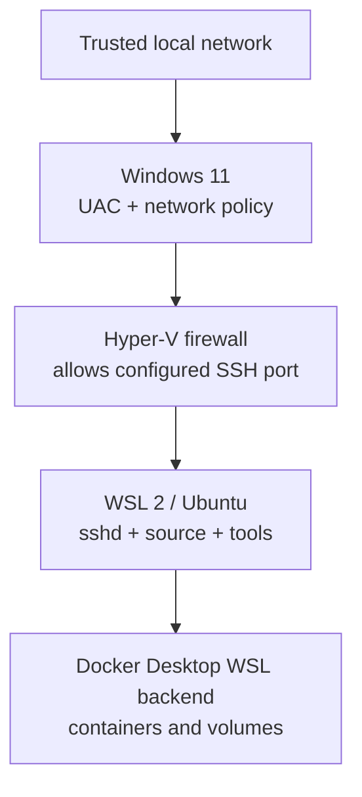

# How otherhost works

This guide explains the system for developers who use Git and a terminal but do
not work with networks every day. You do not need to understand the protocol to
use otherhost; this page makes failures and security decisions less
mysterious.

## The two computers have different jobs

The Windows desktop is the **host** because it provides the computing resources.
The Mac is the **client** because it asks to use those resources.

| Windows host | Mac client |
| --- | --- |
| Runs WSL 2 and Ubuntu | Runs the `otherhost` command |
| Stores the source under the WSL Linux filesystem | Stores its own private SSH key |
| Runs compilers, databases, and Docker containers | Runs the editor, terminal, and browser |
| Accepts an SSH connection from the Mac | Opens secure tunnels to WSL services |

Nothing continuously synchronizes the two filesystems. When you edit remotely,
your editor is operating on files that remain inside WSL.

## A small networking glossary

| Term | Meaning in this project |
| --- | --- |
| **IP address** | A device's local-network address, such as `192.168.1.20` |
| **Port** | A numbered door used by one service on an address |
| **Firewall** | Rules that decide which incoming connections may reach a port |
| **WSL** | The Linux environment running inside the Windows computer |
| **SSH** | The encrypted protocol used for the normal Mac-to-WSL connection |
| **Public key** | The shareable half of the Mac's SSH identity |
| **Private key** | The secret half that stays on the Mac and proves its identity |
| **Host key** | WSL's identity, pinned by the Mac to detect a different server later |
| **Port forward** | A secure path from a Mac localhost port to a service in WSL |
| **Multicast** | A local-network announcement used to find a host without knowing its IP |

An IP address identifies the computer; a port identifies the service on that
computer. otherhost normally uses these ports:

| Port | Protocol | Lifetime | Purpose |
| --- | --- | --- | --- |
| `25370` | UDP multicast | Pairing only | Ask nearby otherhost hosts to identify themselves |
| `25371` | TCP | Pairing only | Direct discovery and the encrypted pairing session |
| `2222` | TCP | Daily use | Public-key-only SSH into WSL |
| Configured app ports | Inside SSH | While connected | Reach apps such as ports `3000` or `8080` from Mac localhost |

Pairing ports should never be forwarded through a router. Their listeners exist
only during the short pairing window.

## There are two separate phases

### Phase 1: pair once

Pairing answers three questions:

1. Which Windows otherhost does the Mac want to use?
2. Does the person at each computer see the same connection?
3. Which cryptographic identities should both computers remember?

The six digits are not a password. Both helpers independently calculate them
from the complete temporary session; the digits are not sent across the
network. If another device tries to sit between the Mac and Windows, the two
screens should calculate different codes. Rejecting a mismatch stops the session
before an SSH key is installed.

After confirmation, each side stores only what it needs:

| Location | Persistent state |
| --- | --- |
| Mac `~/.ssh/otherhost_ed25519` | Dedicated private SSH key for new installations; never copied elsewhere |
| Mac `~/.ssh/otherhost_known_hosts` | The trusted WSL SSH host identity for new installations |
| Mac checkout `otherhost.local.conf` | Host address, WSL user, SSH port, and forwarded ports |
| WSL `~/.ssh/authorized_keys` | The Mac's public SSH key |
| Windows/WSL checkout `otherhost.local.conf` | Machine-specific host policy, ignored by Git |

### Phase 2: connect every day

Once paired, the temporary pairing helper is no longer involved. The Mac uses
standard OpenSSH directly:

If a web application listens on WSL port `3000`, the tunnel makes it appear at
`http://127.0.0.1:3000` on the Mac. The application is not opened to every
device on the local network; only processes on the Mac can use that localhost
endpoint.

`otherhost connect` does not start the application. It keeps the secure path open.
The application or Docker Compose stack must already be running on the host.

## How discovery finds Windows

The Mac does not initially know the host's IP address. `otherhost pair` therefore
uses two local methods:

1. **Multicast discovery:** the Mac sends one request to a special local group
   address. A Windows host in pairing mode replies with its device name and
   temporary session identifier.
2. **Bounded direct discovery:** if multicast receives no response, the Mac
   probes pairing port `25371` only on addresses in its local IPv4 subnet. It
   accepts only replies that speak the expected otherhost protocol.

The second method exists because some routers, VPNs, and WSL configurations do
not pass multicast reliably. It is a fallback, not an internet-wide scan.

Windows may be connected by Ethernet and the Mac by Wi-Fi. They count as being
on the same network when the router places them in the same reachable local
subnet. They will usually not see each other when the Mac is on guest Wi-Fi,
wireless client isolation is enabled, a VPN changes the route, or a firewall
blocks the temporary listener.

## Where Windows, WSL, and Docker fit

WSL is a Linux virtual environment managed by Windows. Mirrored networking lets
services inside WSL participate in the Windows computer's local network without
a manually maintained address translation rule.

The project clone used for builds should live under `~/src` inside WSL, not
under `/mnt/c`. Linux tools and Docker bind mounts are faster and more predictable
when the source is in the Linux filesystem beside the build environment.

## What the setup command changes

`setup.cmd` first checks the machine and shows a plan. After confirmation and a
Windows UAC prompt, it coordinates the host layers:

- selects WSL resource settings appropriate for the host;
- creates or updates machine-local configuration without overwriting unrelated
  values;
- enables WSL mirrored networking when required;
- creates a narrowly scoped Hyper-V firewall rule for SSH;
- installs and hardens OpenSSH inside Ubuntu;
- prepares `authorized_keys` for the later pairing step;
- pins the WSL operational clone to the reviewed Windows checkout revision.

The command does not install Docker Desktop, change router settings, copy a
private key, expose SSH publicly, or start your project.

## Trust boundaries and limitations

otherhost assumes that both computers and their operating-system accounts
are controlled by you. Pairing protects the initial key exchange against a
local active attacker only when you compare the device name and all six digits
on both screens.

It does not protect secrets from malware or an attacker who already controls the
Mac, Windows, WSL, or your account. It also does not turn public Wi-Fi into a
trusted network, maintain OS patches, encrypt disks, or provide off-site access
by itself.

For the precise cryptographic design, see [Architecture and decisions](architecture.md).
For deployment rules and private vulnerability reporting, see the
[Security policy](../SECURITY.md).

## Find the layer that failed

Most failures belong to one boundary:

| Symptom | Likely boundary | First check |
| --- | --- | --- |
| Mac finds no host | Local network or temporary firewall | Windows pairing output and Mac `[diag]` lines |
| Codes differ | Pairing transcript or wrong device | Reject both prompts and restart |
| Pairing completes but SSH times out | WSL listener, address, or Hyper-V firewall | `otherhost doctor` and WSL port `2222` |
| SSH reports `Permission denied` | Mac key or WSL `authorized_keys` | Compare public-key fingerprints |
| Browser URL does not load | Tunnel or application | Keep `otherhost connect` open and check the app in WSL |
| Docker commands fail | Docker Desktop WSL integration | Run `docker info` inside Ubuntu |

Continue with the step-by-step [Troubleshooting guide](troubleshooting.md).
