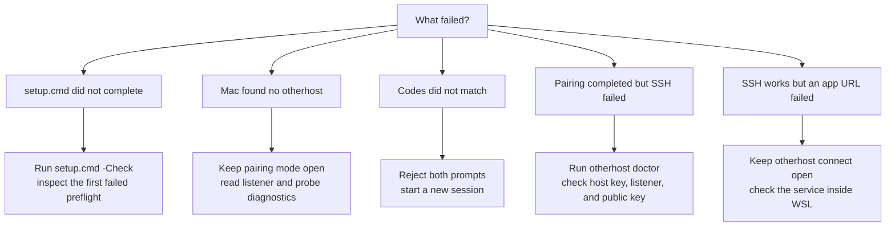

# Troubleshooting

Work from the host outward: Windows, WSL, Docker and SSH, then the Mac client.
Avoid changing several layers at once; rerun the relevant check after each fix.

## Start with the symptom



| Symptom | Most likely layer | Go to |
| --- | --- | --- |
| Windows setup preflight fails | Windows, WSL, or required software | [Windows setup fails](#windows-setup-does-not-complete) |
| `otherhost pair` reports zero endpoints | Pairing listener, route, or firewall | [Discovery finds no host](#otherhost-pair-finds-no-windows-otherhost) |
| An endpoint responds but is incompatible | Stale helper or another service on the port | [Discovery diagnostics](#otherhost-pair-finds-no-windows-otherhost) |
| Codes differ | Wrong device or altered session | [Codes do not match](#the-pairing-codes-do-not-match) |
| Host-key error | WSL identity changed | [Host-key error](#pairing-succeeds-but-otherhost-doctor-reports-a-host-key-error) |
| SSH timeout | Address, listener, or Hyper-V firewall | [SSH timeout](#ssh-times-out-from-the-mac) |
| `Permission denied (publickey)` | Key installation or identity selection | [Public-key failure](#ssh-says-permission-denied-publickey) |
| Local URL is unavailable | Tunnel, port conflict, or application | [Forwarded port conflict](#a-forwarded-port-is-already-in-use-on-the-mac) |

Do not disable host-key checking, enable SSH passwords, broadly open the
firewall, or expose a port through the router as a diagnostic shortcut. Those
changes hide the failed layer and weaken the final system.

## Windows setup does not complete

Run the read-only preflight from the Windows checkout:

```powershell
.\setup.cmd -Check
```

Address the first `[fail]` result rather than rerunning with different manual
policy. Common causes are an unsupported Windows build, missing or uninitialized
Ubuntu distribution, inactive systemd, a dirty launcher checkout, or Docker
Desktop not being available for container checks.

If normal setup completed but `.\setup.cmd -Pair` ends with `Windows pairing
mode failed`, review the preserved elevated transcript:

```powershell
Get-Content "$env:LOCALAPPDATA\otherhost\logs\pairing-latest.log" -Tail 100
```

The final detailed error before the generic launcher message identifies the
failed helper, firewall, WSL key handoff, or listener step. Do not share the
transcript without reviewing it: it may contain device names, usernames, local
paths, LAN addresses, and the temporary comparison code.

Setup verifies that its checkout is clean and that the WSL operational clone is
at the same revision. Commit or discard intentional development changes before
testing the privileged launcher; never bypass the revision check with an
unreviewed script copy.

## Collect a safe diagnostic snapshot

From PowerShell:

```powershell
Get-ComputerInfo -Property WindowsProductName, WindowsVersion, OsBuildNumber
wsl --version
wsl --list --verbose
ipconfig
if (Get-Command Get-NetFirewallHyperVRule -ErrorAction SilentlyContinue) {
    Get-NetFirewallHyperVRule -Name otherhost-ssh -ErrorAction SilentlyContinue
}
```

From Ubuntu:

```bash
uname -a
ps -p 1 -o comm=
systemctl status ssh --no-pager
ss -lnt | grep 2222
docker info
docker system df
df -h /
free -h
```

From the Mac:

```bash
otherhost pair
otherhost doctor
nc -vz YOUR_WINDOWS_IP 2222
```

Pairing diagnostics use the `[diag]` prefix. They include local IP ranges,
device names, and executable paths but never private keys, ephemeral pairing
keys, or the six-digit comparison code. Redact identifying values before sharing
logs.

Before posting output publicly, remove LAN addresses, usernames, hostnames, and
project paths. Never include private keys, tokens, `.env` files, or application
logs containing credentials.

## `otherhost pair` finds no Windows otherhost

Start `.\setup.cmd -Pair` on Windows first. Discovery remains active for two
minutes. Confirm that both devices use the same trusted LAN and the Wi-Fi access
point does not isolate wireless clients. The launcher detects the active Windows
profile and subnet; it does not require changing a Public profile to Private.

Pairing first uses IPv4 multicast UDP port `25370` for discovery. If multicast
is suppressed, the Mac automatically probes TCP port `25371` on a bounded set of
addresses in its local IPv4 subnet. The same TCP port carries the short-lived
encrypted session. Windows creates local-subnet firewall rules only while the
pairing command runs. Do not expose either port through a router.

These ports stay below the common ephemeral ranges used by WSL, Windows, and
macOS. This matters with mirrored WSL networking because ports reserved for WSL
ephemeral connections can also be unavailable to Windows-native listeners.

The Mac now reports each phase separately. A failure before any endpoint
responds looks similar to:

```text
[diag] Pairing helper version: VERSION
[diag] multicast discovery received no compatible response
[diag] direct discovery probing 254 address(es) on TCP 25371 in 192.168.1.0/24
[diag] direct discovery completed 254/254 probe(s): 0 endpoint(s) responded, 0 compatible otherhost(es)
```

Zero responding endpoints means the Windows listener is absent or blocked.
Responding endpoints with zero compatible hosts means something answered on
the port but did not return the expected protocol. On Windows, verify that the
output reports the helper version, temporary firewall rules, and active TCP
listener before running `otherhost pair` on the Mac. A capability error mentioning
user-scoped WSL means the published helper is older than the checked-out setup
script; update the release rather than bypassing that check.

Windows pairing writes its latest elevated transcript to
`%LOCALAPPDATA%\otherhost\logs\pairing-latest.log`. The log records setup and
listener diagnostics without private SSH keys. Review it locally before sharing
because it may contain device names, usernames, LAN addresses, and the temporary
comparison code.

The Windows launcher captures helper capability output outside PowerShell's
error stream. This keeps expected `host -h` usage text from terminating pairing
when the elevated transcript is active under Windows PowerShell 5.1.

The Windows helper places the normalized Mac public key as base64 data in a
temporary LF-only script created under WSL `/tmp`, writes it through the
`\\wsl.localhost` filesystem, executes it by Linux path, and removes it
afterward. This avoids empty `authorized_keys` entries from native-process stdin,
`bash -c` argument reparsing, and Windows-path quoting through `wslpath`. The
value is an SSH public key; private key material never leaves the Mac.

If neither method finds the host, disconnect VPN software and verify that the
access point does not isolate wireless clients. The explicit GitHub public-key
recovery flow remains documented in [macOS client](macos.md).

## The pairing codes do not match

Choose **No** on both devices. Pairing stops without installing a key. Restart
pairing from Windows and compare a new code. Never proceed after a mismatch;
different values indicate that the session transcripts or ephemeral keys differ.

## Pairing succeeds but `otherhost doctor` reports a host-key error

Pairing pins the WSL Ed25519 host key in
`~/.ssh/otherhost_known_hosts`. A mismatch means the WSL host identity or
address changed after pairing. Verify the host locally before removing the
pinned entry, then pair again. Do not disable strict host-key checking.

## `git: command not found` inside WSL

The repository cannot bootstrap Git before it has been cloned. Install the one
initial dependency manually:

```bash
sudo apt-get update
sudo apt-get install -y git
```

Clone into `~/src`, not `/mnt/c`.

## PowerShell cannot find the repository path

Confirm that Ubuntu is running and that its registered name matches the config:

```powershell
wsl --list --quiet
$Distro = "Ubuntu"
$WslUser = (& wsl.exe -d $Distro -- whoami).Trim()
Test-Path "\\wsl.localhost\$Distro\home\$WslUser\src\otherhost"
```

Use the exact distribution name returned by WSL. Opening Ubuntu once also ensures
that its Linux user and home directory have been created.

## Mirrored networking is rejected

Mirrored networking requires Windows 11 22H2, build 22621 or newer, and a current
Store version of WSL. Check `winver` and `wsl --version`, then install Windows and
WSL updates before applying the configuration again.

This release does not automate the NAT-mode port proxy. Do not switch to NAT and
assume the Mac will still reach SSH.

## Docker is unavailable inside Ubuntu

Open Docker Desktop and verify:

1. **Settings > General > Use the WSL 2 based engine** is enabled.
2. **Settings > Resources > WSL Integration** enables the configured Ubuntu
   distribution.
3. `docker info` works inside Ubuntu after Docker Desktop restarts.

Do not install a second Docker daemon inside Ubuntu to work around a disabled
Docker Desktop integration.

## systemd is inactive

Inspect the WSL configuration:

```bash
cat /etc/wsl.conf
ps -p 1 -o comm=
```

After the bootstrap adds `[boot]` and `systemd=true`, run `wsl --shutdown` from
PowerShell and reopen Ubuntu. PID 1 should then be `systemd`.

## SSH times out from the Mac

A timeout normally points to the address, network, or firewall layer.

Inside Ubuntu:

```bash
systemctl is-active ssh
ss -lnt | grep 2222
```

On Windows, confirm the firewall rule and active LAN address:

```powershell
Get-NetFirewallHyperVRule -Name otherhost-ssh
ipconfig
```

On the Mac, make sure `host` uses the active Windows Ethernet or Wi-Fi IPv4
address, both machines are on the same trusted network, and then test:

```bash
nc -vz YOUR_WINDOWS_IP 2222
```

## SSH says `Permission denied (publickey)`

Compare the dedicated Mac fingerprint with the exact key selected in WSL:

```bash
# Mac
ssh-keygen -lf ~/.ssh/otherhost_ed25519.pub -E sha256

# Ubuntu / WSL
ssh-keygen -lf ~/.ssh/authorized_keys -E sha256
grep '^ssh_public_key=' ~/src/otherhost/otherhost.local.conf
ls -ld ~/.ssh
ls -l ~/.ssh/authorized_keys
```

The `.ssh` directory should normally be mode `700` and `authorized_keys` mode
`600`. On the Mac, confirm `identity_file` points to the dedicated private key.
Never copy that private key into WSL or GitHub.

## A forwarded port is already in use on the Mac

Find the process holding the local port:

```bash
lsof -nP -iTCP:3000 -sTCP:LISTEN
```

Stop that process or choose a different unused port in `otherhost.local.conf`. Keep
the configured port aligned with the service listening inside WSL.

## Disk or memory pressure returns

Inspect before deleting anything:

```bash
docker system df
df -h /
free -h
```

Do not run broad Docker prune commands until you have reviewed which images,
containers, volumes, and build cache are safe to remove.
